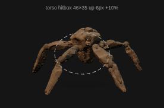

# 🪨 Rocky Desktop Pet

> A tiny, transparent, always-on-top macOS companion inspired by the rock xenomorph from *Project Hail Mary* — movie-accurate silhouette, basalt shading, and five expressive limbs.


[](https://github.com/cozyss/rocky-desktop-pet)
[](#)
[](#)
[](package.json)

---

## ✨ What it is

Rocky lives on your desktop as a 276×182 transparent window. No dock icon, no shadow, just stone. He watches your cursor, waves goodbye, knocks on the xenonite, and does a little mirror dance when you ask.

This repo is the **private, full-fidelity Rocky build** that uses the official promotional STL-derived articulated GLB (11 joints, 5 clips) and the polished Final Look v4 materials. For a clean-room MIT-licensed generic engine without any film assets, see [cozyss/pentapod-desktop-pet](https://github.com/cozyss/pentapod-desktop-pet).

## 📸 Gallery

| Idle | Walk | Goodbye (Movie) | Knock | Mirror Dance |
|------|------|-----------------|-------|--------------|
|  |  |  |  | See contact sheet |

### Contact sheets

Full action overview (body-only hitbox v10, still the same look as v13):


### Hitbox visualization – torso-only clickable

In v13 final the **clickable area is only Rocky's torso ellipse** (rx=46, ry=35 at 138,90). Limbs, shadow and transparent corners pass through so you stop misclicking.

- Body center → interactive
- Far limb / shadow / corner → click-through
- Outline is OFF by default, toggle with **H** or `?showHitbox=1`




Live preview: [rocky-motion-lab • v13 bigger-up](https://rocky-motion-lab.on-solid.com/preview.html?v=tighter-hitbox-v13-bigger-up&showHitbox=1)

## 🎮 Features – v0.9.0 / v13 final

- **276×182 tight window** – 40%+ smaller than original 400×330, 10% smaller than v6, only ~2 px margins around solid pixels
- **Torso-only ellipse hitbox** – only central body is interactive; limbs click through
- **Alpha-aware hysteretic hit testing** – enter 36 / leave 18, radius 5, 2 misses required, shadow not clickable
- **5 film-inspired actions** – `CuteIdle`, `Walk`, `MovieGoodbye`, `Knock`, `MirrorDance`
- **Canonical face = forearm gap** – bisector of Limb1/Limb2 used by MovieGoodbye; outer pivot so animation clips never fight facing
- **Cursor following** – smooth yaw with extremes ±0.5 rad; click actions first face viewer then hold
- **Drag anywhere** – across displays, position persisted and validated; drag never triggers action
- **Right-click menu** – Walk / Quit
- **Final Look v4 materials** – warm basalt #55483C-#66584A palette, roughness 0.84-0.92, subtle mineral bands, transparent-safe contact shadow (1.8×0.8 plane, opacity 0.15)
- **Electron 37, Three r160, DPR capped 1.35, no WebGL errors**

## 📦 Install – macOS Apple Silicon

1. Download latest ZIP from [Releases](https://github.com/cozyss/rocky-desktop-pet/releases) or `release/` folder (`Rocky-Desktop-Pet-macOS-Apple-Silicon-v9-torso-v13-final.zip`, SHA-256 `94660a7463cd...`)
2. Unzip → move `RockyDesktopPet.app` to `/Applications`
3. Open. If Gatekeeper says damaged:

```bash
xattr -dr com.apple.quarantine "/Applications/RockyDesktopPet.app"
open "/Applications/RockyDesktopPet.app"
```

App is ad-hoc signed, not notarized.

## 🕹️ Usage

- **Drag**: grab torso and move. Works across monitors.
- **Short click on torso**: randomly `MovieGoodbye` or `Knock` only; Rocky first turns to face you, then performs, then resumes cursor follow.
- **Click on limb / shadow / transparent**: passes through to the app behind – no misclick.
- **Right click**: Walk / Quit.

## 🛠️ Dev

Node 22 required (`nvm use`).

```sh
npm ci
npm run build   # builds rocky3d-tighter-hitbox-v13-bigger-up.js → dist?
npm start       # electron .
npm run check   # syntax checks main + preload
```

Key files:

- `main.js` – 276×182 window, migration from legacy 340×285, position persistence, walk window motion
- `src/scene.js` – THREE setup, GLB loader for `assets/rocky-full-rig-multi-action-final-v2d.glb`, facing pivot outside mixer, 5 clips map, contact shadow 1.8×0.8
- `index.html` – 276×182 stage, ellipse body hit test `BODY_RX=46 BODY_RY=35 BODY_CENTER_Y=90`, drag/menu guards, H to toggle outline
- `preview.html` – public preview used by rocky-motion-lab tunnel

Versioning: `package.json` 0.9.0, `VERSION='tighter-hitbox-v13-bigger-up'` in scene + main + preview + cache bust.

## 📚 Credits / Sources

- Rocky design inspired by *Project Hail Mary* (Andy Weir novel & Amazon MGM film). Official promo model: promotional STL archive from Amazon MGM (no redistribution license, private use only in this repo).
- Three.js (MIT), Electron (MIT), esbuild (MIT)
- Procedural fallback placeholder and icon are original.

See `CREDITS.md` / `SOURCES.md` / `LEGAL.md` in the public clean-room repo for full canonical references. This private repo does not grant rights to redistribute official film assets.

## ⚖️ License

Code in this repo (main, preload, scene, preview) is MIT where original, but the bundled GLB `assets/rocky-full-rig-multi-action-final-v2d.glb` and some screenshots are derived from promotional film assets and are **not licensed for redistribution**. Do not publish this GLB or its derivatives publicly. For public sharing, use [pentapod-desktop-pet](https://github.com/cozyss/pentapod-desktop-pet) which ships only original procedural geometry.

---

Made with ☄️ for desktop companionship. Rocky says: *three knocks means “I’m here.”*
