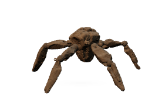
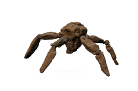
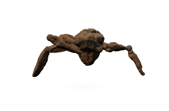
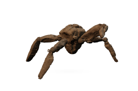
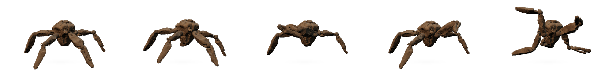
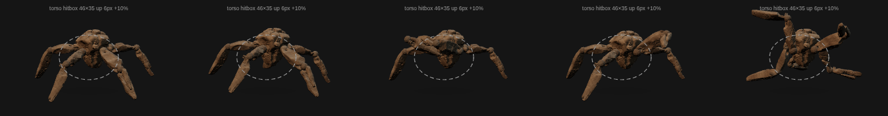

# 🪨💫 Rocky Desktop Tamagotchi

> Your tiny rocky roommate from *Project Hail Mary* — now a desktop tamagotchi. Transparent, always-on-top, watches your cursor, knocks back, does a little mirror dance.

### ⬇️ Download for Mac in 10 seconds

**👉 [Download v0.9.0 for Mac (Apple Silicon) – 116 MB ZIP](https://github.com/cozyss/rocky-desktop-tamagotchi/releases/download/v0.9.0-tamagotchi/Rocky-Desktop-Tamagotchi-macOS-Apple-Silicon-v0.9.0.zip)**

[](https://github.com/cozyss/rocky-desktop-tamagotchi/releases/download/v0.9.0-tamagotchi/Rocky-Desktop-Tamagotchi-macOS-Apple-Silicon-v0.9.0.zip)
[](https://rocky-motion-lab.on-solid.com/preview.html)

**What you get:** A 276×182 transparent window. No dock icon. Just Rocky sitting on your desktop.

---

### 🚀 Quick Start — 3 steps

1. **Unzip & Move**
   - Unzip `RockyDesktopPet.app` → drag to `/Applications`

2. **First open (Gatekeeper)**
   ```bash
   xattr -dr com.apple.quarantine "/Applications/RockyDesktopPet.app"
   open "/Applications/RockyDesktopPet.app"
   ```
   If macOS still blocks: System Settings → Privacy & Security → Open Anyway.

3. **Play!**
   - **Drag torso** anywhere — works across monitors, position saved
   - **Click torso** — short click → randomly **👋 Goodbye** or **✊ Knock** (Rocky turns to face you first!)
   - **Click limb / shadow** → passes through to app behind (no misclicks!)
   - **Right-click** → Walk / Quit

> App is ad-hoc signed, not Apple-notarized. SHA-256: `94660a7463cd3d8f657a23de823dcbed3ba49272fb43f311e46999eeac024245` (116 MB)



---

### 🎮 What can Rocky do?

| Idle | Walk | Goodbye (Movie) | Knock | Mirror Dance |
|------|------|-----------------|-------|--------------|
|  |  |  |  | 💃 See contact sheet |

**Actions:**
- 😌 **CuteIdle** – breathes, looks at your cursor (face = gap between two forearms)
- 🚶 **Walk** – window itself marches across screens
- 👋 **MovieGoodbye** – inner-forearm graze, 5 strokes back-and-forth (like in film)
- ✊ **Knock** – 3 taps on xenonite wall (proof-of-life call-and-response)
- 💃 **MirrorDance** – awkward puppet sync / Macarena-like mirror (research-backed)

**Contact sheet / hitbox:**




Live preview where buttons actually work: https://rocky-motion-lab.on-solid.com/preview.html

---

### 📸 Gallery / Preview explanation

This is a **web preview** of what Rocky looks like on real desktop:

- In **browser**: you see Rocky inside a checkerboard box (simulates transparent window). Use buttons below or click directly on Rocky to trigger actions.
- On **real Mac**: that checkerboard = fully transparent. Only Rocky and tiny shadow are visible. Window is always-on-top, click-through except torso.

Try it now: https://rocky-motion-lab.on-solid.com/preview.html — buttons for Idle/Walk/Goodbye/Knock/Dance now work! Press H to see torso-only clickable area (grey ellipse).

---

### ✨ Features — v0.9.0 / torso-v13 final

- **276×182 tight window** — 40% smaller than original 400×330
- **Torso-only hitbox** rx=46 ry=35 at 138,90 — only body interactive
- **Alpha-aware hysteresis** enter 36 / leave 18 / radius 5 — shadow never clickable
- **5 film-inspired clips** from articulated 11-joint rig
- **Outer facing pivot** so animations never fight cursor facing
- **Transparent, Electron safe**: ACES + sRGB, DPR 1.35, ≤100k tris
- **Drag suppression**: drag never triggers action

---

### 🛠️ Dev (Node 22)

```sh
npm ci
npm run build
npm start
```

Key files: `main.js` (276×182 window + persistence), `src/scene.js` (GLB + facing), `index.html` (ellipse hit test + postMessage for preview), `preview.html` (new user-friendly preview).

---

### 🧬 Two modes in one repo

- **Full-fidelity Rocky (default)**: `assets/rocky-full-rig-multi-action-final-v2d.glb` — 11 joints, 5 clips, Final Look v4 basalt. Gorgeous, but NOT MIT for assets — personal use only.
- **Clean generic**: Delete GLB/PNG/ZIP and use `private-assets/pet.glb` override → 100% MIT procedural pentapod (from old pentapod-desktop-pet).

---

### 📚 Credits

- Rocky & Project Hail Mary by Andy Weir — novel + Amazon MGM film. Fan-made, not affiliated.
- Official refs: YouTube t3GaBssOgv8 “Grace Meets Rocky” clip, GIPHY loop, Creating Rocky video
- Three.js MIT, Electron MIT, esbuild MIT

See `CREDITS.md` `SOURCES.md`

---

### ⚠️ Disclaimer / Legal — PLEASE READ

**Fan-made / not official.** Not affiliated with Andy Weir / Amazon MGM. Rocky design rights belong to holders.

**Two asset classes:**
1. **Code & procedural placeholder** MIT (see `LICENSE`)
2. **Film-derived assets**: `assets/*.glb`, fallback PNG, screenshots showing Rocky likeness, ZIPs — derived from promo materials, no redistribution license found, included for **personal non-commercial educational/portfolio demo only**. Not MIT. Do not redistribute commercially.

For 100% MIT safe build, remove class 2 and use generic mode.

See `DISCLAIMER.md` `ASSET_POLICY.md` `LEGAL.md`.

---

Made with ☄️ — Three knocks means “I’m here.”
